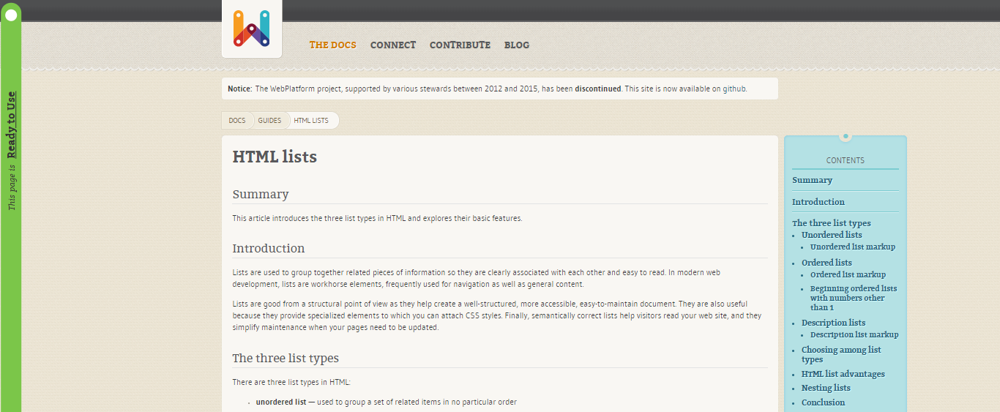
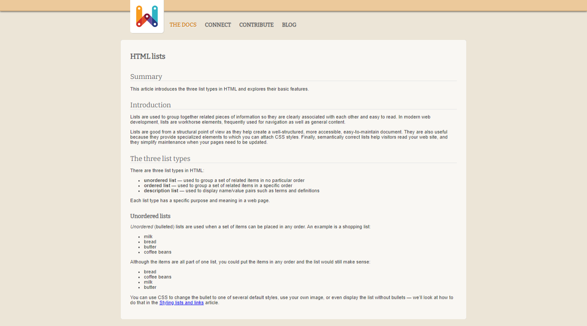

# Interface Web

L'objectif était de réaliser une copie d'une interface web. Cela nous permettait de mettre en pratique les connaissances en HTML & CSS acquises durant le cours d'Interfaces Web.

### Interface modèle

https://webplatform.github.io/docs/guides/html_lists/

### Interface réalisée

### Auteurs

[Antonin VERDIER](https://github.com/lacaulac) & [Arthur REITER](https://github.com/arthur-reiter/)